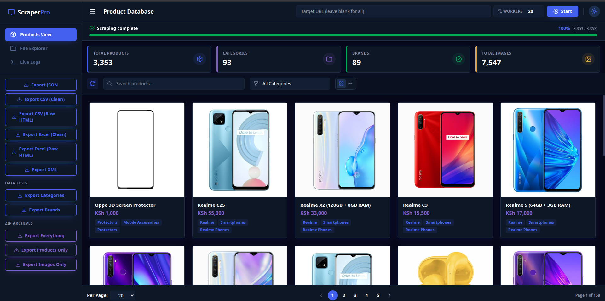

# E-Commerce Scraper 🚀


A robust, concurrent, UI-driven scraper for e-commerce storefronts — WooCommerce, Shopify, Magento, OpenCart, Django-Oscar or bespoke. Point it at any store URL and it discovers the entire catalogue from sitemaps, platform APIs or a listing crawl, reads each product from its schema.org structured data, works around browser-fingerprint blocks, and presents a responsive dashboard to manage, monitor, browse and export the scraped data. Each store is kept in its own folder, so you can scrape as many as you like side by side.

---

## 🛠️ Tech Stack

### Frontend
- **React (Vite)**: Lightning-fast development environment and optimized production builds.
- **Tailwind CSS**: Utility-first CSS framework for rapid UI styling, customized with a premium Vristo-inspired theme (dark/light mode support).
- **Lucide React**: Beautiful, consistent iconography.
- **Fetch API**: Native browser API for seamless communication with the backend.

### Backend
- **Python 3.9+**: The core language powering the scraping engine.
- **Flask**: A lightweight WSGI web application framework serving the API and compiled frontend.
- **asyncio**: Powers the asynchronous, non-blocking scraping architecture to process hundreds of pages concurrently.
- **curl_cffi**: Advanced HTTP client that impersonates real browser TLS fingerprints to seamlessly bypass Cloudflare anti-bot protections.
- **BeautifulSoup4 & lxml**: High-performance HTML parsing and data extraction.
- **markdownify**: Automatically converts messy HTML product descriptions into clean, readable Markdown files.
- **Pandas**: Utilized for robust and flexible Excel (`.xlsx`) data exports.

---

## ✨ Key Features

- **Works On Any Store**: Give it any store URL and it finds the whole catalogue — no per-site configuration. Discovery layers sitemaps, platform APIs (WooCommerce Store API, WP REST, Shopify `products.json`, OpenCart routes) and a bounded listing crawl, and **merges** the results rather than stopping at the first hit.
- **Platform-Neutral Extraction**: Product details are read from schema.org structured data (JSON-LD, then microdata) first, Open Graph meta tags second, and theme CSS selectors only as a fallback. Every storefront that wants Google rich results publishes structured data, so extraction works the same on Shopify, Magento, Django-Oscar and heavily customised WooCommerce themes. Each record carries an `extracted_by` map naming the layer that produced each field.
- **Smart Bot Evasion**: Impersonates real browser TLS fingerprints via `curl_cffi`, and **escalates through several browser profiles** when a host rejects the default — many hosts serve Chrome a 403 interstitial but answer Safari normally. The working profile is remembered per host. (Sites presenting an interactive JavaScript challenge remain unsupported, and are reported as such rather than retried.)
- **High-Speed Concurrent Scraping**: Downloads product pages and images rapidly using asynchronous tasks (with configurable worker limits).
- **Resumable & Verifiable**: Failed URLs are retried with backoff, recorded to `failed_urls.json`, and re-running skips what's already saved — so an interrupted scrape picks up where it left off.
- **One Folder Per Store**: Each site lands in `data/<domain>/`, and re-scraping asks whether to update in place or keep the old copy as a timestamped version.
- **Structured File Storage**: Organizes scraped data into a predictable tree (`data/<domain>/structured/Category/Brand/Product/`).
- **Markdown Conversion**: Automatically sanitizes and converts HTML product descriptions into clean `.md` files for easy reading and editing.
- **Beautiful Dashboard UI**: A full-featured React dashboard to monitor live scraping progress, view logs, explore local files, and browse products in a grid or list layout.
- **Export Flexibility**: Export your data exactly how you need it. Choose between raw HTML or clean text formats for JSON, CSV, XML, Excel (.xlsx).
- **Archive Generation**: Download the entire structured image and markdown repository as a ZIP archive directly from the UI!

---

## 💻 Local Setup & Installation

Follow these steps to get the project running on your local machine.

### Prerequisites
- [Python 3.9+](https://www.python.org/downloads/)
- [Node.js 18+](https://nodejs.org/) & npm

### 1. Backend Setup

1. **Clone the repository** and navigate to the root directory:
   ```bash
   cd webscrapper
   ```
2. **Create a Python virtual environment**:
   ```bash
   python -m venv venv
   ```
3. **Activate the virtual environment**:
   - **Linux / macOS**:
     ```bash
     source venv/bin/activate
     ```
   - **Windows**:
     ```cmd
     venv\Scripts\activate
     ```
4. **Install the required Python dependencies**:
   ```bash
   pip install flask flask-cors beautifulsoup4 lxml curl_cffi aiofiles markdownify pandas openpyxl gunicorn
   ```

### 2. Frontend Setup

1. **Navigate to the frontend directory**:
   ```bash
   cd frontend
   ```
2. **Install Node modules**:
   ```bash
   npm install
   ```
3. **Build the React frontend** (This bundles the app into `frontend/dist` which Flask serves):
   ```bash
   npm run build
   ```
   *(Note: If you plan on actively developing the UI, you can run `npm run dev` in this directory to start the Vite hot-reload server at `http://localhost:5173`)*

---

## 🚀 Running the Application

This project uses a unified Flask server to serve both the Backend REST APIs and the compiled React Frontend UI.

### 1. Activate the Virtual Environment
Before starting the server, you must activate the Python virtual environment in your terminal from the project root directory.

- **On Linux / macOS:**
  ```bash
  source venv/bin/activate
  ```
- **On Windows (Command Prompt / PowerShell):**
  ```cmd
  venv\Scripts\activate
  ```

### 2. Start the Server

**Option A: Production Server (Recommended - High Speed)**
This runs the app with 4 concurrent worker processes, ensuring blazing fast UI performance and instantaneous data exports without freezing.
```bash
./venv/bin/gunicorn --workers 4 --bind 0.0.0.0:5000 app:app
```
*(Note: Gunicorn is natively supported on Linux/macOS. If you are on Windows, use Option B instead).*

**Option B: Development Server (Basic/Standard)**
If you do not have Gunicorn installed or are running natively on Windows, you can start the standard Python development server:
```bash
./venv/bin/python app.py
```

### 3. Access the Dashboard
Once the server is running (using either option), open your web browser and navigate to:
**[http://127.0.0.1:5000](http://127.0.0.1:5000)**

---

## 🧪 Tests

The suite is offline — no requests leave the machine and nothing is written to `data/`
(both `app.py` and `main.py` have their storage paths redirected at a `tmp_path`).

```bash
source venv/bin/activate
pip install -r requirements-dev.txt
pytest
```

| File | Covers |
| :--- | :--- |
| `tests/test_parser.py` | JSON-LD extraction, image-variant deduplication, breadcrumb/brand heuristics |
| `tests/test_client_retry.py` | Retry policy — transient statuses retried, `404` not; `Retry-After` handling |
| `tests/test_downloader.py` | Skip-if-present, `.part` atomic rename, concurrency limit |
| `tests/test_main_storage.py` | HTML cache, JSONL dedupe + torn-line recovery, resume, progress reporting |
| `tests/test_api.py` | Incremental products cache, pagination/search, every export format, path-traversal guard |

> **Note:** the root-level `test_brand.py`, `test_client.py` and `test_product.py` are
> hand-run diagnostic probes that hit the live site on import — `pytest.ini` pins
> `testpaths = tests` so a plain `pytest` never collects them.

---

## 📖 How to Use

1. **Enter a store URL**: Any URL on the store will do — its homepage, a category, or a single product. The whole catalogue is discovered from the site's sitemaps.
2. **Set Workers**: Adjust the number of **Concurrent Workers**. Higher scrapes faster; 8 is a sensible default that avoids tripping rate limits on Cloudflare-fronted sites.
3. **Confirm**: Review the target and destination folder in the confirmation dialog, then click **Start Scraping**. If you've scraped that store before, you'll be asked whether to update the existing data or save it as a new version.
4. **Watch**: The dashboard shows live progress and terminal output in the Live Logs view.
5. **Browse**: Browse the extracted products in Grid or List view, search by keyword, and filter by category. Use the site selector in the header to switch between scraped stores.
6. **Inspect files**: The File Explorer previews JSON, Markdown and images inline, or opens the raw file in a new tab.
7. **Export**: Use the sidebar buttons to export your data as JSON, CSV, Excel, XML or ZIP — each in clean-text or raw-HTML flavours.

If any URLs failed, they're listed in that store's `failed_urls.json`. Just run the scrape again — already-saved products are skipped, so only the gaps are retried.

---

## 📁 Data Structure

Every store gets its own folder under `data/`, named after its domain. Re-scraping a store can either update that folder in place or create a timestamped version beside it, leaving the original untouched:

```text
data/
├── example-store.com/                      # one folder per store
│   ├── products.json                       # every product scraped from this store
│   ├── categories.json
│   ├── failed_urls.json                    # URLs that failed, with reasons
│   └── structured/
│       └── Smartphones/
│           └── Realme_Phones/
│               └── Realme_5/
│                   ├── data.json           # Product metadata (price, URL, etc.)
│                   ├── description.md      # Long description converted to Markdown
│                   ├── short_description.txt
│                   └── images/             # Downloaded product images
├── example-store.com_v2_20260728-014500/   # a re-scrape kept as a separate version
└── another-store.co.ke/                    # a different store
```
